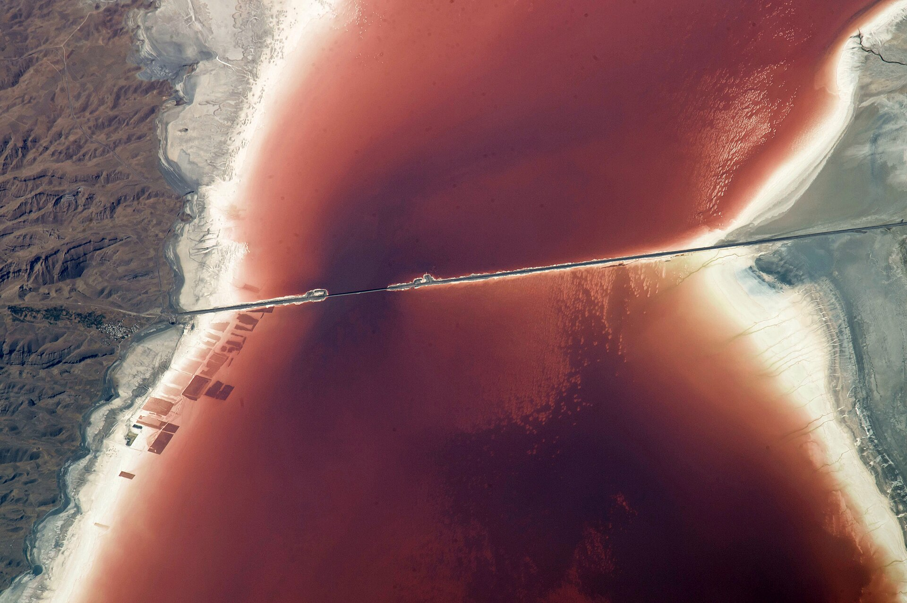
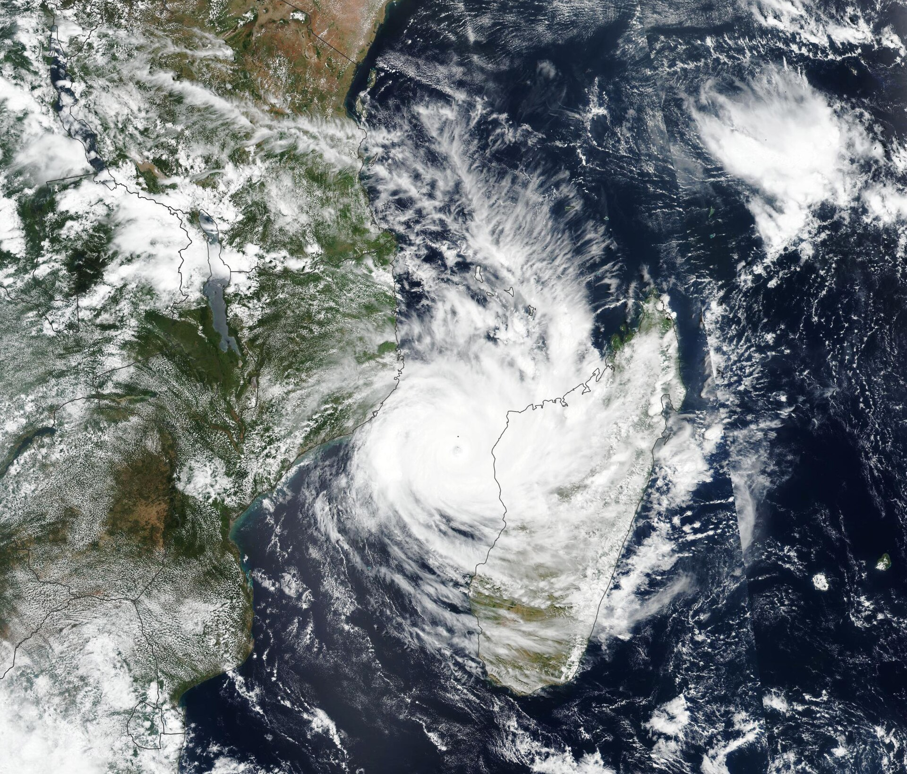
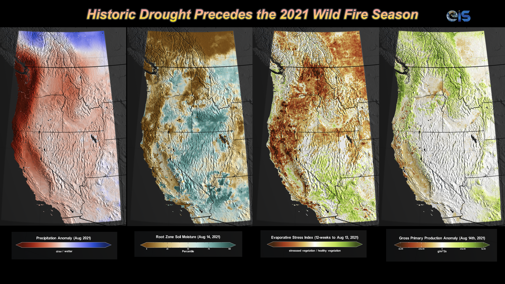
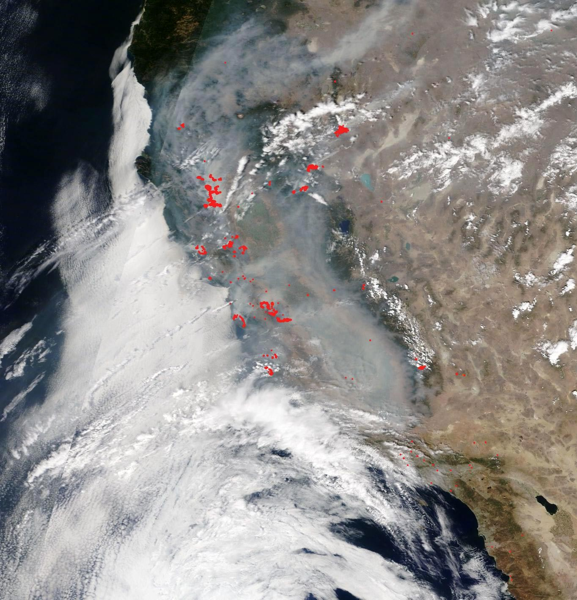
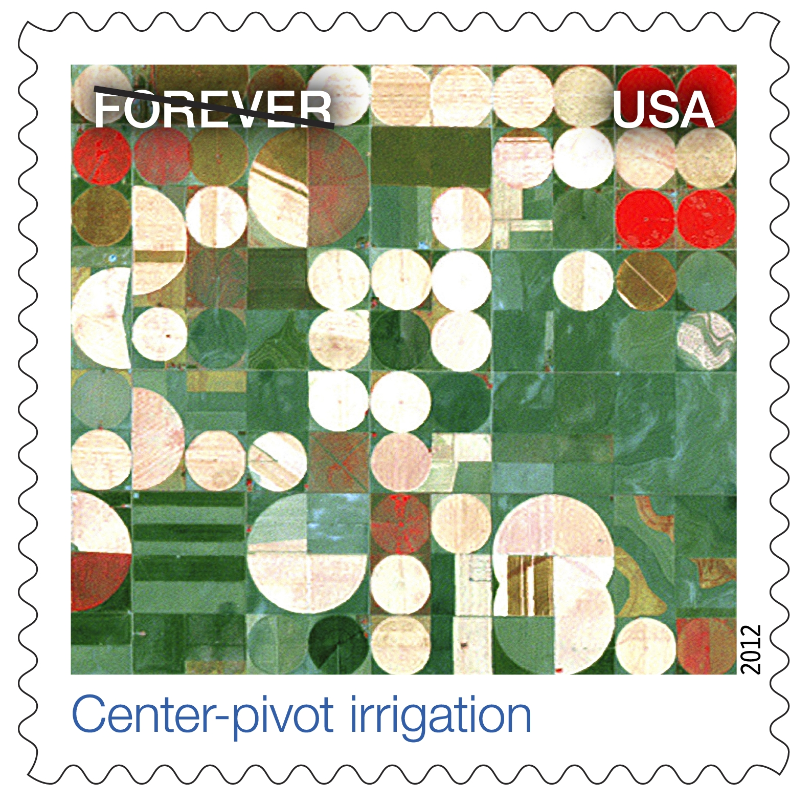

# Earth Engine Remote Sensing Portfolio

A curated collection of **24 production-ready Google Earth Engine scripts**,
organised into five application areas that together cover the major use
cases of operational satellite remote sensing: surface water, floods,
drought, fire & heat, and agriculture.

Every script is self-contained, fully documented, and ready to drop into
the [GEE Code Editor](https://code.earthengine.google.com). The headers
declare the datasets used, the region targeted, and the expected output;
the tunable parameters are pulled to the top as `ALL_CAPS` constants;
numbered section comments walk the reader through each pipeline step.

| | |
|---|---|
| **Scripts** | 24 polished `.js` files across 5 categories |
| **Code** | 4,047 lines of GEE JavaScript |
| **Datasets** | Landsat 5/7/8, Sentinel-1/2, MODIS, AVHRR, CHIRPS, GSMaP, PERSIANN, TRMM, SMAP, MERRA-2, GLDAS, ERA5-Land, FLDAS, JRC GSW, FIRMS, GHSL, FAO GAUL, USDA NASS CDL, HydroSHEDS |
| **Techniques** | OTSU thresholding, Random Forest classification, SAR change detection, SPI, Mann-Kendall + Sen-slope, SUHI stratification, NDVI/EVI compositing, water-balance accounting, exposure-based damage assessment |

---

## Quick navigation

| Category | Scripts | Lines |
|---|---|---|
| [01 — Surface water & lake dynamics](#01--surface-water--lake-dynamics) | 5 | 831 |
| [02 — Flood & inundation mapping](#02--flood--inundation-mapping) | 4 | 661 |
| [03 — Drought, soil moisture & groundwater](#03--drought-soil-moisture--groundwater) | 5 | 933 |
| [04 — Fire, heat & urban climate](#04--fire-heat--urban-climate) | 5 | 877 |
| [05 — Agriculture, vegetation & land cover](#05--agriculture-vegetation--land-cover) | 5 | 745 |

---

## 01 — Surface water & lake dynamics

*Lake Urmia, Iran — ISS Earth Observation. Public domain, NASA / Earth Science and Remote Sensing Unit.*

### What this category does
Inland water bodies — lakes, reservoirs, river systems — are the most
sensitive remote-sensing indicator of regional water balance. This category
provides five end-to-end pipelines that quantify lake surface area, classify
water vs. non-water at the pixel level, account for the hydrological forcings
driving lake change (precipitation, evapotranspiration, soil moisture), and
extract specialty signals (salt-crust dynamics, basin-scale hydroclimate)
that matter for endorheic lakes such as Urmia, Aral, and Caspian.

### Why it matters
Lake Urmia (pictured above) lost over 80% of its surface area between 1995
and 2015. Quantifying that change requires combining decades of optical
satellite data (Landsat 5 through 8), a stable water-occurrence reference
(JRC Global Surface Water), and the hydroclimatic drivers from
re-analysis products. The same pipelines apply to thousands of lakes
worldwide.

### Scripts → see [`01_surface_water_dynamics/`](01_surface_water_dynamics/)

| Script | Technique | Datasets |
|---|---|---|
| `lake_area_jrc_global_surface_water.js` | Multi-year JRC GSW lake-area time series | JRC Global Surface Water Yearly |
| `multi_lake_water_balance_modis_chirps.js` | Water-balance components per lake | CHIRPS, MOD16 ET, SMAP soil moisture, ALOS DEM |
| `otsu_water_threshold_landsat.js` | OTSU between-class-variance water classification | Landsat 5/7/8 SR (harmonised) |
| `salt_lake_optical_indices.js` | Salt-crust optical index time series | Landsat 8, MODIS, custom SI = (Green + Red) / 2 |
| `river_basin_hydroclimate_aggregation.js` | Basin-scale zonal climatology | CHIRPS, ERA5-Land, MOD10A1 NDSI, FLDAS SWE, HydroSHEDS |

---

## 02 — Flood & inundation mapping

*Cyclone Idai making landfall over Mozambique, 11 March 2019 — VIIRS Suomi NPP. Public domain, NASA Earth Observatory / Lauren Dauphin.*

### What this category does
Operational flood mapping combines two questions: *where did the flood
extend?* and *what was exposed to it?* The four scripts here implement the
full workflow used by humanitarian responders. The SAR-based extent
detector uses pre/post Sentinel-1 GRD imagery, speckle filtering, and a
slope mask. The exposure layer overlays the flood mask with the JRC
permanent-water reference, GHSL population, MODIS land cover, and a DEM
to compute affected population, damaged cropland, and inundated urban area.

### Why it matters
The default AOI for the SAR and reporting scripts is the **Cyclone Idai /
Beira, Mozambique** event of March 2019 (pictured) — one of the deadliest
tropical cyclones ever recorded in the Southern Hemisphere. The pipeline
re-produces the kind of rapid damage estimate that UN-SPIDER, Copernicus
Emergency Management Service, and the World Bank GFDRR use for disaster
response.

### Scripts → see [`02_flood_inundation_mapping/`](02_flood_inundation_mapping/)

| Script | Technique | Datasets |
|---|---|---|
| `sar_flood_extent_sentinel1.js` | Pre/post Sentinel-1 change detection + speckle filter + slope mask | Sentinel-1 GRD (VH+VV), JRC GSW, SRTM |
| `optical_flood_extraction_sentinel2.js` | Sentinel-2 NDWI/MNDWI dual-index confirmation | Sentinel-2 SR |
| `flood_exposure_population_landcover.js` | Population × land-cover exposure overlay | Sentinel-1, GHSL, MODIS MCD12Q1, SRTM |
| `flood_damage_assessment_report.js` | Affected-area / -population / -cropland reporter | Above + FAO GAUL admin units; exports CSV + GeoJSON |

---

## 03 — Drought, soil moisture & groundwater

*"Historic drought precedes the 2021 wild fire season" — precipitation anomaly, root-zone soil moisture, evaporative stress index, and gross primary production anomaly across the U.S. west. Public domain, NASA's Scientific Visualization Studio.*

### What this category does
Drought is a multi-variable phenomenon — it manifests in precipitation,
soil moisture, evapotranspiration, vegetation greenness, and groundwater
levels on different timescales. This category implements the rigorous
statistical methods used to detect and characterise drought from satellite
data: the **Standardised Precipitation Index** (SPI) over 1, 3, 6, 12, 24,
and 48-month windows from CHIRPS; multi-product precipitation comparison
across CHIRPS, GSMaP, PERSIANN-CDR, and TRMM; the **Mann-Kendall trend
test with Sen-slope** for long-term significance; the **Evapotranspiration
Stress Index** from MODIS MOD16; and MERRA-2 root-zone soil moisture over
aquifer polygons.

### Why it matters
The NASA visualization above shows exactly the kind of multi-variable
analysis the category produces. The same workflows underpin the U.S.
Drought Monitor, the FAO ASIS, and the World Bank's drought-monitoring
dashboards across MENA and Sub-Saharan Africa. The Mann-Kendall script
is publication-grade: tie-corrected variance, Sen-slope median, two-sided
p-value, and a significance mask.

### Scripts → see [`03_drought_groundwater/`](03_drought_groundwater/)

| Script | Technique | Datasets |
|---|---|---|
| `standardized_precipitation_index.js` | Rolling-window SPI (1/3/6/12/24/48 months) | CHIRPS daily |
| `precipitation_dataset_comparison.js` | Multi-product daily mm harmonisation + overlay chart | CHIRPS, GSMaP v6, PERSIANN-CDR, TRMM 3B42 |
| `mann_kendall_trend_analysis.js` | Mann-Kendall pairwise sign + Sen-slope + p-value | Any monthly raster collection |
| `modis_evapotranspiration_drought.js` | ET / PET → ESI drought metric | MODIS MOD16A2 |
| `merra_soil_moisture_aquifers.js` | Root-zone soil moisture zonal stats over aquifers | MERRA-2 |

---

## 04 — Fire, heat & urban climate

*California wildfire complex, August 2020 — Terra MODIS true colour with active-fire pixels in red. Public domain, NASA.*

### What this category does
Thermal infrared and active-fire products turn the satellite into a
fire-and-heat sensor. This category implements **MODIS FIRMS active-fire
detection** with temporal compositing and confidence thresholding;
**Landsat 8 single-channel Land Surface Temperature** with a proper
NDVI-derived emissivity (Sobrino-style); a **20-year monthly Surface
Urban Heat Island** time series stratified by MCD12Q1 land cover within
FAO GAUL city admin boundaries; **MODIS Terra + Aqua day vs. night LST**
sampling at station points; and a **Random-Forest urban land-cover
classifier** that feeds spectral indices, DEM, and Landsat SMW LST
into the feature stack.

### Why it matters
The image above shows the August 2020 California fire complex, with the
red dots being exactly the active-fire pixels the FIRMS detection script
identifies. The Surface UHI pipeline replicates the methodology that
appears in dozens of peer-reviewed urban-climate studies. The Random
Forest LCC classifier was applied across six Landsat epochs (1985–2019)
to track urban growth.

### Scripts → see [`04_fire_heat_urban_climate/`](04_fire_heat_urban_climate/)

| Script | Technique | Datasets |
|---|---|---|
| `firms_active_fire_detection.js` | Daily AOI clip + seasonal max-confidence composite | MODIS FIRMS (Terra + Aqua) |
| `landsat_surface_temperature_timeseries.js` | Brightness-temp → NDVI-FV emissivity → single-channel LST | Landsat 8 SR (B10 + B4/B5) |
| `surface_urban_heat_island_monthly.js` | Monthly urban - rural LST stratification by FAO GAUL admin | MOD11A1, MCD12Q1, FAO GAUL L2 |
| `modis_lst_day_night_seasonal.js` | Per-station day/night LST extraction across Terra + Aqua | MOD11A1 + MYD11A1 |
| `urban_land_cover_classification_landsat.js` | RF + SMW LST + 21 spectral indices + DEM | Landsat 5/7/8 TOA, SRTM, SMW LST module |

---

## 05 — Agriculture, vegetation & land cover

*Center-pivot irrigation Landsat composite — the canonical "agriculture from space" image. Public domain, USPS Forever Stamp series featuring Landsat imagery, NASA / USGS.*

### What this category does
Vegetation indices and supervised classification are the workhorses of
land-cover mapping and agricultural monitoring. This category provides
five canonical pipelines: a **Random Forest land-cover classifier** with
proper train/test confusion-matrix validation; **multi-temporal NDVI
compositing** across harmonised Landsat 5/7/8; **AVHRR/MODIS
evapotranspiration and PET** time series; a **crop-type classifier** using
USDA NASS CDL as labels with Sentinel-2 features; and **ERA5-Land monthly
snow cover** for cryosphere studies.

### Why it matters
The image above shows the unmistakable geometry of center-pivot
irrigation captured by Landsat — those circles are agricultural fields,
typically 400 m radius, that have been classified, monitored, and yield-
forecasted for decades using exactly the techniques these scripts
implement. The crop-type classifier uses USDA NASS Cropland Data Layer
(the U.S. national crop ground-truth product), making it directly
comparable to USDA NASS yield forecasts.

### Scripts → see [`05_agriculture_vegetation_land_cover/`](05_agriculture_vegetation_land_cover/)

| Script | Technique | Datasets |
|---|---|---|
| `random_forest_landcover_classification.js` | RF + spectral indices + train/test confusion matrix | Landsat or Sentinel-2 SR |
| `multi_temporal_ndvi_landsat.js` | Long-term NDVI compositing across harmonised L5/L7/L8 | Landsat 5/7/8 SR (cloud-masked) |
| `evapotranspiration_pet_avhrr.js` | Monthly PET / AET reductions | AVHRR + MODIS |
| `crop_type_classification_usda_cdl.js` | Stratified-sample RF with USDA CDL labels | Sentinel-2 SR, USDA NASS CDL |
| `era5_snow_cover_timeseries.js` | Monthly snow-cover / SWE aggregation | ERA5-Land |

---

## How to use a script

1. Click into any category folder above.
2. Open the `.js` file — the **header docblock** tells you which datasets it
   uses, what region it targets, and what it outputs.
3. Copy the file's contents into the [GEE Code Editor](https://code.earthengine.google.com).
4. Edit the **ALL-CAPS constants** at the top (study area, dates,
   thresholds, asset paths). The `users/<YOUR_GEE_USERNAME>/...` placeholders
   point at private assets you must replace with your own ingestions.
5. Click **Run**. Map layers and console charts appear immediately; CSV /
   GeoTIFF exports queue under the **Tasks** tab and need a manual confirm.

A few scripts depend on community modules (FIRMS batch export, Landsat SMW
LST module) that GEE will ask you to authorise once per Google account —
each script's header notes which.

---

## Why this layout

- **Categorised by application, not by technique.** Time-series compositing
  and zonal stats appear everywhere — they're not what differentiates these
  scripts; the *target phenomenon* (lake area, flood extent, drought, fire,
  vegetation) is.
- **Curated, not exhaustive.** These 24 scripts are the strongest of a much
  larger personal corpus. Quality over volume.
- **Human-readable code.** Variable names like `lakeAreaTimeSeries`,
  `monthlyUhiTimeSeries`, and `randomForestClassifier` instead of `lats`,
  `ut`, `clf`. Long names are deliberate.
- **Self-contained scripts.** Each `.js` file runs on its own; nothing
  depends on anything else in the repo. A small amount of duplication
  is the cost; the gain is obvious portability.

---

## Image credits

All hero images embedded in this README are NASA / U.S. Government works,
public domain, sourced from Wikimedia Commons:

| Section | Image | Author / source |
|---|---|---|
| 01 Surface water | Lake Urmia from the ISS | NASA Earth Science and Remote Sensing Unit |
| 02 Flood | Cyclone Idai 2019-03-11 | NASA Earth Observatory / Lauren Dauphin (VIIRS Suomi NPP) |
| 03 Drought | "Historic drought precedes the 2021 wild fire season" | NASA Scientific Visualization Studio |
| 04 Fire & heat | August 2020 California wildfires | NASA Terra (MODIS) |
| 05 Agriculture | Landsat center-pivot irrigation | NASA / USGS, on USPS "Earthscapes" Forever Stamp 2012 |

---

## License

Not yet specified — add a `LICENSE` (e.g. MIT) before broad re-use.
